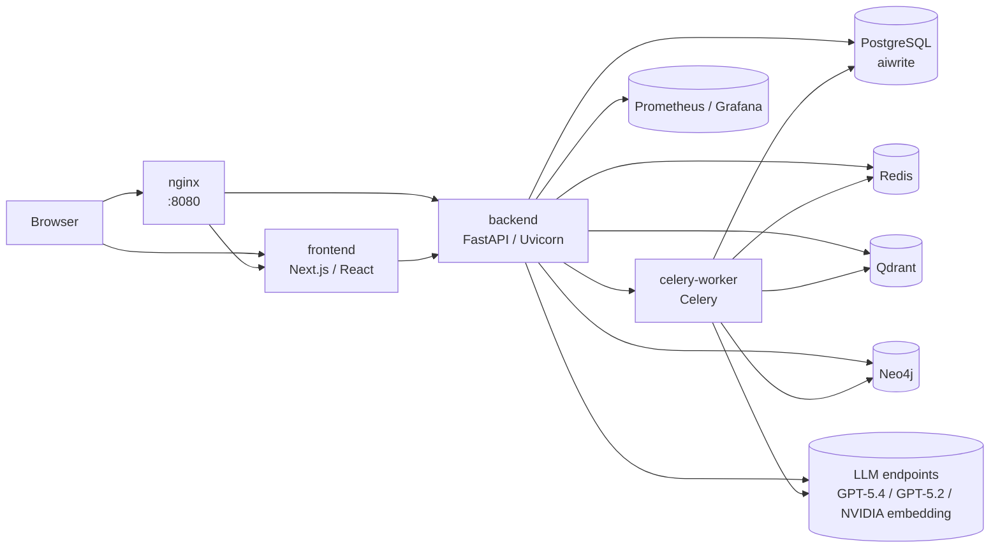
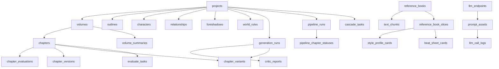
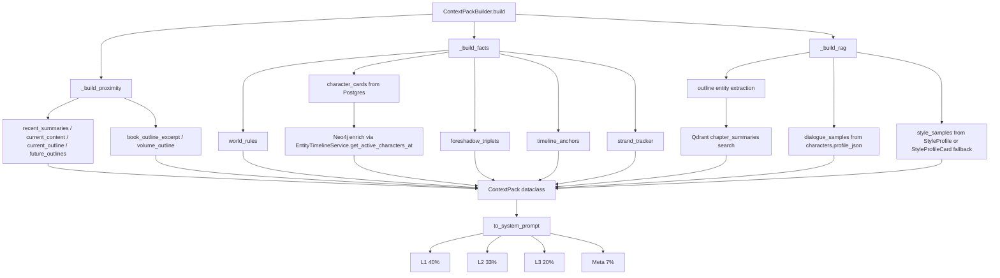

# AI-Write Project Structure

## 项目概览

AI-Write 是一个面向长篇网络小说生产的 AI 写作系统。它的系统目标不是“做出一个 200 万字测试项目”，而是让单部作品在**500 万字+**体量下仍然能维持可检索、可回溯、可扩展、可分层压缩的生产能力；`projects.target_word_count` 当前 schema 默认值虽然还是 `3000000`，但这只是数据库默认参数，不是系统上限。

当前仓库状态：

- 当前分支：`feature/v1.0-big-bang`
- 当前 HEAD：`ec74de8`
- 当前已发版本：`v1.8.0`
- 当前主仓源码/配置文件统计（`*.py/*.ts/*.tsx/*.yaml/*.yml`，排除 `.worktrees`、`node_modules`、`.venv`、`.next` 等生成物）：`298` 个文件
- 语言分布：Python `224`、TSX `59`、TypeScript `10`、YAML `5`、SQL `0`
- 关键长文件：`backend/app/services/context_pack.py` `1518` 行、`backend/app/services/prompt_registry.py` `944` 行、`backend/app/services/chapter_generator.py` `98` 行

| 维度 | 现状 |
| --- | --- |
| 后端 | FastAPI + SQLAlchemy asyncio + Alembic |
| 异步任务 | Celery + Redis broker/result backend |
| 主数据库 | PostgreSQL `aiwrite` |
| 图状态 | Neo4j（实体时间线 / 角色状态 / 关系状态） |
| 向量检索 | Qdrant（chapter summaries + decompile artifacts） |
| 前端 | Next.js `16.2.3` + React `19.2.4` + Zustand + ProseMirror |
| 观测 | Prometheus + Grafana + Sentry + JSON logging |
| 导出 | EPUB / PDF / DOCX |
| 主要模型接入 | OpenAI-compatible endpoints（当前库里有 `gpt-5.4(high)`、`gpt-5.2(high)`）+ NVIDIA embeddings |

## 服务拓扑



运行态上，后端直接暴露在 `127.0.0.1:8000`，nginx 暴露在 `:8080`。当前 `http://localhost:8080/api/health` 和 `http://localhost:8000/api/health` 都返回 `200 {"status":"ok"}`，说明 nginx 现在已经能代理 `/api`，旧文档里“返回 502”的说法已经过期。

## 仓库目录树

```text
/root/ai-write
├── AGENTS.md
├── CHANGELOG.md
├── ITERATION_PLAN.md
├── RELEASE_NOTES_v1.4.md
├── RELEASE_NOTES_v1.4.1.md
├── RELEASE_NOTES_v1.5.0.md
├── RELEASE_NOTES_v1.6.0.md
├── RELEASE_NOTES_v1.7.0.md
├── RELEASE_NOTES_v1.7.1.md
├── RELEASE_NOTES_v1.7.2.md
├── RELEASE_NOTES_v1.7.3.md
├── RELEASE_NOTES_v1.7.4.md
├── RELEASE_NOTES_v1.8.0.md
├── docker-compose.yml
├── .env.example
├── backend
│   ├── Dockerfile
│   ├── pyproject.toml
│   ├── alembic.ini
│   ├── alembic
│   │   ├── env.py
│   │   └── versions
│   │       ├── c7cdeccaf965_initial_schema_with_all_16_tables.py
│   │       ├── a0504000_v05_prompt_routing.py
│   │       ├── a0600000_v06_decompile.py
│   │       ├── a0700000_v07_state_machine.py
│   │       ├── a0800000_v08_writing_engine.py
│   │       ├── a0900000_v09_settings_graph.py
│   │       ├── a1001300_v13_target_word_count.py
│   │       ├── a1001400_v14_llm_tier.py
│   │       ├── a1001500_v150_outline_book_unique.py
│   │       ├── a1001700_v150_evaluate_tasks.py
│   │       ├── a1001800_v150_cascade_tasks.py
│   │       └── a1001900_v150_world_rule_cascade_metadata.py
│   ├── app
│   │   ├── config.py
│   │   ├── main.py
│   │   ├── api
│   │   │   ├── generate.py
│   │   │   ├── projects.py
│   │   │   ├── chapters.py
│   │   │   ├── prompts.py
│   │   │   ├── settings.py
│   │   │   ├── knowledge.py
│   │   │   ├── versions.py
│   │   │   └── ...
│   │   ├── db
│   │   │   ├── session.py
│   │   │   ├── redis.py
│   │   │   ├── qdrant.py
│   │   │   └── neo4j.py
│   │   ├── graphs
│   │   │   └── generation_graph.py
│   │   ├── middlewares
│   │   │   ├── quota.py
│   │   │   └── request_logging.py
│   │   ├── models
│   │   │   ├── project.py
│   │   │   ├── decompile.py
│   │   │   ├── generation_run.py
│   │   │   ├── pipeline.py
│   │   │   ├── prompt.py
│   │   │   └── writing_engine.py
│   │   ├── observability
│   │   │   ├── logging.py
│   │   │   ├── metrics.py
│   │   │   └── sentry_init.py
│   │   ├── prompts
│   │   │   ├── v174_generation_v3.txt
│   │   │   ├── v174_generation_v4.txt
│   │   │   ├── v174_generation_v5.txt
│   │   │   ├── v174_generation_v6.txt
│   │   │   └── v174_polishing_v3.txt
│   │   ├── schemas
│   │   │   └── project.py
│   │   ├── services
│   │   │   ├── context_pack.py
│   │   │   ├── prompt_registry.py
│   │   │   ├── chapter_generator.py
│   │   │   ├── scene_orchestrator.py
│   │   │   ├── chapter_evaluator.py
│   │   │   ├── entity_timeline.py
│   │   │   ├── outline_to_facts.py
│   │   │   ├── reference_ingestor.py
│   │   │   ├── qdrant_store.py
│   │   │   ├── version_control.py
│   │   │   ├── hook_manager.py
│   │   │   ├── prompt_cache.py
│   │   │   ├── agents
│   │   │   └── checkers
│   │   ├── tasks
│   │   │   ├── __init__.py
│   │   │   ├── entity_tasks.py
│   │   │   ├── evaluation_tasks.py
│   │   │   ├── knowledge_tasks.py
│   │   │   ├── cascade.py
│   │   │   └── style_tasks.py
│   │   └── utils
│   │       └── crypto.py
│   ├── scripts
│   │   ├── cleanup_orphan_qdrant_slices.py
│   │   ├── seed_genre_profiles.py
│   │   └── seed_multi_agent_prompts.py
│   └── tests
│       ├── test_c1_scene_orchestrator.py
│       ├── test_c2_auto_revise.py
│       ├── test_c3_prompt_cache.py
│       ├── test_c4_cascade.py
│       ├── test_v174_p03_outline_to_facts.py
│       └── services
├── frontend
│   ├── Dockerfile
│   ├── package.json
│   └── src
│       ├── app
│       │   ├── page.tsx
│       │   ├── workspace/page.tsx
│       │   ├── knowledge/page.tsx
│       │   ├── prompts/page.tsx
│       │   ├── settings/page.tsx
│       │   ├── vector/page.tsx
│       │   ├── llm-routing/page.tsx
│       │   └── ...
│       ├── components
│       │   ├── project/ProjectListPage.tsx
│       │   ├── workspace/DesktopWorkspace.tsx
│       │   ├── workspace/MobileWorkspace.tsx
│       │   ├── workspace/WorkspaceLayout.tsx
│       │   ├── editor/EditorView.tsx
│       │   ├── outline/OutlineTree.tsx
│       │   └── panels/*.tsx
│       ├── lib
│       │   ├── api.ts
│       │   ├── syncManager.ts
│       │   └── i18n/*
│       └── stores
│           ├── projectStore.ts
│           ├── generationStore.ts
│           └── knowledgeStore.ts
├── nginx
│   └── nginx.conf
├── observability
│   ├── prometheus.yml
│   └── grafana/provisioning/*
├── postgres-init
│   ├── 01-ensure-password.sh
│   └── pg_hba.conf
└── scripts
    ├── cleanup_orphan_qdrant_slices.py
    ├── seed_genre_profiles.py
    └── seed_multi_agent_prompts.py
```

## 后端模块职责矩阵

| 路径 | 职责 | 关键依赖 | 调用方 |
| --- | --- | --- | --- |
| `backend/app/api/` | FastAPI route 层，负责鉴权、参数校验、SSE、HTTP 响应契约 | FastAPI、SQLAlchemy `AsyncSession`、services、Pydantic schemas | frontend、curl/smoke、后台脚本 |
| `backend/app/services/` | 领域服务层，承载 ContextPack、PromptRegistry、章节生成、场景编排、评估、向量/图检索、导出等核心逻辑 | models、db adapters、LLM endpoints、Qdrant、Neo4j | `api/`、`tasks/`、部分脚本 |
| `backend/app/services/checkers/` | 多 checker 质量检查与审查规则，实现 continuity/OOC/anti-AI 等维度 | model_router、Neo4j、ContextPack-like inputs | `critic_service.py`、质量面板 |
| `backend/app/services/agents/` | 辅助 agent 级服务，如 plot/style agent | prompt_registry、model_router | generation / polishing 旁路 |
| `backend/app/models/` | SQLAlchemy ORM，定义项目、章节、角色、向量切片、任务、日志与写法引擎资产 | SQLAlchemy、Alembic | `api/`、`services/`、`tasks/` |
| `backend/app/schemas/` | Pydantic 请求/响应模型，主要集中在 project/settings 领域 | Pydantic v2 | `api/` |
| `backend/app/tasks/` | Celery 任务入口，承担知识库处理、实体抽取、评估、cascade、定时任务 | Celery、Redis、services、db、Neo4j、Qdrant | `docker-compose` 的 `celery-worker`、部分 `services/` 通过 `send_task` 分发 |
| `backend/app/workers/` | **目录不存在**；“worker”并不是单独目录，而是 `backend/app/tasks/` + `docker-compose.yml` 里的 `celery-worker` service | N/A | N/A |
| `backend/app/prompts/` | 文本 prompt 资产快照，存放 generation/polishing 多版本 prompt 文件 | prompt_registry、人工调优流程 | 手工调优、部分 DB upsert 流程 |
| `backend/app/core/` | **目录不存在**；配置/启动职责分散在 `app/config.py`、`app/main.py`、`app/db/*` | N/A | N/A |
| `backend/app/db/` | 基础设施适配层，提供 SQLAlchemy session、Redis、Qdrant、Neo4j 初始化与 dependency | SQLAlchemy、Redis、Qdrant client、Neo4j driver | `api/`、`services/`、`tasks/`、lifespan |
| `backend/app/utils/` | 小型通用工具，当前主要是 API key 加解密 | `cryptography`/Fernet | `main.py`、model config APIs |
| `backend/app/crud/` | **目录不存在**；CRUD 没有单独抽层，而是由 `api/` + `services/` 直接用 ORM session 完成 | N/A | N/A |
| `backend/app/graphs/` | LangGraph 级实验性/可选编排层 | LangGraph、generation state | `generation_runs` 相关路径 |
| `backend/app/observability/` | JSON logging、Prometheus metrics、Sentry init | loguru、prometheus_client、sentry-sdk | `main.py`、`tasks/__init__.py` |
| `backend/app/middlewares/` | HTTP 中间件：配额拦截、请求日志、Request ID | FastAPI/Starlette | `main.py` |

## 关键类与函数索引

### ContextPack 与拼装主链

| 路径:行号 | 名称 | 类型 | 一行职责 |
| --- | --- | --- | --- |
| `backend/app/services/context_pack.py:67` | `CharacterCard` | class | 角色状态卡片，渲染位置/实力/关系/心理/近期动作 |
| `backend/app/services/context_pack.py:80` | `CharacterCard.to_prompt` | func | 把角色卡片转成 prompt 文本 |
| `backend/app/services/context_pack.py:97` | `CFPGTriplet` | class | 伏笔三元组（cause/foreshadow/payoff） |
| `backend/app/services/context_pack.py:109` | `CFPGTriplet.to_prompt` | func | 根据 proximity 渲染伏笔状态文本 |
| `backend/app/services/context_pack.py:120` | `TimeAnchor` | class | 时间线锚点 |
| `backend/app/services/context_pack.py:131` | `TimeAnchor.to_prompt` | func | 渲染时间线锚点 |
| `backend/app/services/context_pack.py:140` | `StrandTracker` | class | 三线（Quest/Fire/Constellation）节奏跟踪 |
| `backend/app/services/context_pack.py:156` | `StrandTracker.get_warnings` | func | 计算线索失衡告警 |
| `backend/app/services/context_pack.py:176` | `StrandTracker.to_prompt` | func | 渲染线索平衡摘要 |
| `backend/app/services/context_pack.py:191` | `ContextPack` | class | 4 层上下文容器 |
| `backend/app/services/context_pack.py:226` | `ContextPack._estimate_tokens` | func | 粗估 token 数 |
| `backend/app/services/context_pack.py:229` | `ContextPack._truncate_to_budget` | func | 按 budget 裁切文本 |
| `backend/app/services/context_pack.py:236` | `ContextPack._render_volume_outline_block` | func | 渲染卷级 outline block |
| `backend/app/services/context_pack.py:290` | `ContextPack.to_system_prompt` | func | 按 L1/L2/L3/Meta 预算拼完整 system prompt |
| `backend/app/services/context_pack.py:435` | `ContextPack.to_messages` | func | 把 system prompt 与 user instruction 封装为 messages |
| `backend/app/services/context_pack.py:458` | `ContextPackBuilder` | class | 协调 PostgreSQL/Qdrant/Neo4j 构建 ContextPack |
| `backend/app/services/context_pack.py:465` | `ContextPackBuilder.__init__` | func | 绑定或延迟创建 AsyncSession |
| `backend/app/services/context_pack.py:469` | `ContextPackBuilder._get_db` | func | 惰性获取 DB session |
| `backend/app/services/context_pack.py:476` | `ContextPackBuilder.close` | func | 关闭 builder 自持有 session |
| `backend/app/services/context_pack.py:481` | `ContextPackBuilder.build` | func | 主入口：依次构建 proximity/facts/rag |
| `backend/app/services/context_pack.py:549` | `ContextPackBuilder._build_proximity` | func | 装载近期摘要、当前内容、章节/卷/全书大纲 |
| `backend/app/services/context_pack.py:702` | `ContextPackBuilder._build_facts` | func | 装载世界规则、角色卡、伏笔、时间线、三线状态 |
| `backend/app/services/context_pack.py:828` | `ContextPackBuilder._enrich_characters_from_neo4j` | func | 用 Neo4j `EntityTimelineService` 补角色状态与关系 |
| `backend/app/services/context_pack.py:904` | `ContextPackBuilder._build_strand_tracker` | func | 运行三线节奏分析 |
| `backend/app/services/context_pack.py:924` | `ContextPackBuilder._build_rag` | func | 运行 Qdrant 召回、对话样本与风格样本装载 |
| `backend/app/services/context_pack.py:958` | `ContextPackBuilder._extract_entities_from_outline` | func | 从 outline 提取角色/地点/物件关键词 |
| `backend/app/services/context_pack.py:1022` | `ContextPackBuilder._search_qdrant_snippets` | func | 搜索 `chapter_summaries` 和可选 v2 recall collections |
| `backend/app/services/context_pack.py:1077` | `ContextPackBuilder._maybe_rewrite_query` | func | 可选 LLM query rewrite |
| `backend/app/services/context_pack.py:1111` | `ContextPackBuilder._v2_three_way_recall` | func | 三路 recall：style_profiles / beat_sheets / redacted samples |
| `backend/app/services/context_pack.py:1160` | `ContextPackBuilder._load_style_samples` | func | 按 StyleProfile 或 StyleProfileCard fallback 装载风格样本 |
| `backend/app/services/context_pack.py:1223` | `ContextPackBuilder._render_style_profile` | func | 渲染 style profile 与 dosage_profile 到 Layer 3 |
| `backend/app/services/context_pack.py:1316` | `ContextPackBuilder._aggregate_style_cards` | func | 聚合多张 StyleProfileCard 生成参考风格档案 |
| `backend/app/services/context_pack.py:1456` | `fetch_writing_rules` | func | 按 genre profile 解析 writing_rules（当前主生成热路径未接入） |

### Prompt 路由与生成

| 路径:行号 | 名称 | 类型 | 一行职责 |
| --- | --- | --- | --- |
| `backend/app/services/prompt_registry.py:36` | `RouteSpec` | class | prompt 路由快照：endpoint/model/system_prompt/max_tokens |
| `backend/app/services/prompt_registry.py:525` | `PromptRegistry` | class | PromptAsset 管理、读取、seed 和兼容旧 API |
| `backend/app/services/prompt_registry.py:531` | `PromptRegistry.seed_builtins` | func | 启动时增量种入内建 prompts |
| `backend/app/services/prompt_registry.py:582` | `PromptRegistry.resolve_route` | func | 旧式 route 解析（admin/兼容用途） |
| `backend/app/services/prompt_registry.py:609` | `PromptRegistry.resolve_tier` | func | 旧式 tier 解析 |
| `backend/app/services/prompt_registry.py:625` | `PromptRegistry.track_result` | func | 旧式结果回写（热路径已废弃） |
| `backend/app/services/prompt_registry.py:659` | `_resolve_route_and_tier_cached` | func | 基于 `prompt_cache.get_snapshot` 解析 route+tier |
| `backend/app/services/prompt_registry.py:699` | `run_text_prompt` | func | 文本 prompt 入口，支持 ContextPack messages 直传 |
| `backend/app/services/prompt_registry.py:774` | `run_structured_prompt` | func | 结构化 JSON prompt 入口，含 parse retry |
| `backend/app/services/prompt_registry.py:846` | `_try_parse_structured` | func | 宽容 JSON 解析 |
| `backend/app/services/prompt_registry.py:876` | `_normalize_structured` | func | 把 list/非 dict 结果规范化为 dict |
| `backend/app/services/prompt_registry.py:890` | `stream_text_prompt` | func | 流式文本 prompt 入口 |
| `backend/app/services/chapter_generator.py:22` | `ChapterGenerator` | class | `ContextPack -> PromptRegistry` 的薄封装 |
| `backend/app/services/chapter_generator.py:25` | `ChapterGenerator.generate` | func | 非流式章节生成 |
| `backend/app/services/chapter_generator.py:55` | `ChapterGenerator.generate_stream` | func | 流式章节生成 |
| `backend/app/services/chapter_generator.py:86` | `ChapterGenerator._collect_rag_hits` | func | 把 RAG 层展开成可序列化日志结构 |
| `backend/app/services/scene_orchestrator.py:206` | `SceneOrchestrator` | class | scene mode 的章节分镜编排器 |
| `backend/app/services/scene_orchestrator.py:214` | `SceneOrchestrator.plan_scenes` | func | 先用 `scene_planner` 规划场景 |
| `backend/app/services/scene_orchestrator.py:296` | `SceneOrchestrator.write_scene_stream` | func | 用 `scene_writer` 流式写单场景 |
| `backend/app/services/scene_orchestrator.py:334` | `SceneOrchestrator.orchestrate_chapter_stream` | func | 串联规划与逐场景写作 |
| `backend/app/services/chapter_evaluator.py:190` | `ChapterEvaluator` | class | 章节评分器 |
| `backend/app/services/chapter_evaluator.py:199` | `ChapterEvaluator.evaluate` | func | 输出 overall + 维度分数 + issues |

### Worker / 异步任务 / 后处理

| 路径:行号 | 名称 | 类型 | 一行职责 |
| --- | --- | --- | --- |
| `backend/app/tasks/__init__.py:121` | `rebuild_rag_for_project` | func | 重新建立 `chapter_summaries` 向量索引 |
| `backend/app/tasks/__init__.py:133` | `reprocess_reference_book` | func | 参考书反编译主任务 |
| `backend/app/tasks/__init__.py:173` | `retry_reference_book_missing_branches` | func | 仅重试缺失 style/beat 分支 |
| `backend/app/tasks/__init__.py:223` | `_run_async_safe` | func | Celery loop-safe 包装，重置 engine/router |
| `backend/app/tasks/entity_tasks.py:222` | `extract_chapter_entities` | func | 章节实体抽取 Celery 入口，写入 Neo4j |
| `backend/app/tasks/evaluation_tasks.py:150` | `evaluate_chapter_task` | func | 章节异步评估任务 |
| `backend/app/tasks/evaluation_tasks.py:171` | `dispatch_evaluate_task` | func | 分发异步评估任务 |
| `backend/app/tasks/cascade.py:102` | `enqueue_cascade_candidates` | func | 生成 cascade 候选任务 |
| `backend/app/tasks/cascade.py:592` | `_run_cascade_task_async` | func | cascade 核心异步执行逻辑 |
| `backend/app/tasks/cascade.py:806` | `run_cascade_task` | func | cascade Celery 入口 |
| `backend/app/tasks/knowledge_tasks.py:42` | `vectorize_book_task` | func | 参考书向量化 |
| `backend/app/tasks/knowledge_tasks.py:104` | `run_async_generation` | func | 后台异步章节/大纲生成 |
| `backend/app/tasks/knowledge_tasks.py:422` | `run_pipeline_generation` | func | pipeline 式生成 |
| `backend/app/tasks/knowledge_tasks.py:723` | `crawl_book` | func | 书源爬取 |
| `backend/app/tasks/knowledge_tasks.py:843` | `extract_features` | func | 知识库特征抽取 |
| `backend/app/tasks/knowledge_tasks.py:933` | `run_quality_score` | func | 参考书质量评分 |
| `backend/app/services/hook_manager.py:53` | `HookManager` | class | 预/后生成 hook 编排器（当前主热路径未完全接入） |
| `backend/app/services/hook_manager.py:165` | `HookManager.run_post_hooks` | func | 章节后处理：实体、摘要、伏笔处理 |
| `backend/app/services/hook_manager.py:342` | `HookManager._update_entities` | func | 分发实体抽取任务 |
| `backend/app/services/hook_manager.py:368` | `HookManager._generate_summary` | func | 生成章节摘要 |
| `backend/app/services/hook_manager.py:441` | `HookManager._check_foreshadow_resolution` | func | 检查伏笔是否回收 |
| `backend/app/services/hook_manager.py:457` | `HookManager._register_new_foreshadows` | func | 自动登记新伏笔 |

### 向量 / 图 / 版本 / ETL 支撑

| 路径:行号 | 名称 | 类型 | 一行职责 |
| --- | --- | --- | --- |
| `backend/app/services/qdrant_store.py:32` | `QdrantStore` | class | 管理 6 个 Qdrant collections 与 typed search/upsert |
| `backend/app/services/entity_timeline.py:105` | `EntityTimelineService` | class | Neo4j 实体时间线读写总入口 |
| `backend/app/services/entity_timeline.py:531` | `EntityTimelineService.extract_and_update` | func | 从章节文本抽取实体状态并写入图 |
| `backend/app/services/reference_ingestor.py:381` | `reprocess_reference_book` | func | 参考书反编译：切片、style/beat/redacted branches |
| `backend/app/services/outline_to_facts.py:284` | `run_full_etl` | func | 把 outline 导入 characters/foreshadows/world_rules |
| `backend/app/services/version_control.py:101` | `VersionControlService` | class | 章节版本树服务 |
| `backend/app/services/version_control.py:107` | `VersionControlService.create_version` | func | 创建章节版本节点 |
| `backend/app/services/model_router.py:410` | `ModelRouter` | class | 多 provider 注册、tier 解析、fallback 与 embeddings |
| `backend/app/services/model_router.py:894` | `ModelRouter.generate_with_tier_fallback` | func | 按 tier 尝试多个 endpoint 生成 |

## DB schema 总览（“37 张表”是旧口径；当前 public schema 实测 42 张表）

当前运行中的 PostgreSQL `public` schema 有 **42** 张表，其中 `alembic_version` 是迁移元数据表，剩余 **41** 张表是业务/运行时表。任务描述里“37 张表”的说法来自更早的口径；到 `v1.8.0` 为止，`ask_user_pauses`、`evaluate_tasks`、`cascade_tasks`、`langgraph_thread_map`、`usage_quotas` 等表已经进入现网 schema。

单独列出迁移元数据表：

| 表名 | 行数 | 关键字段 | FK | 当前状态 |
| --- | --- | --- | --- | --- |
| `alembic_version` | `1` | `version_num` | 无 | 迁移元数据 |

### 核心创作类

| 表名 | 行数 | 关键字段 | FK | 当前状态 |
| --- | --- | --- | --- | --- |
| `projects` | `69` | `title`, `genre`, `settings_json`, `target_word_count`, `deleted_at` | 无 | 已启用 |
| `volumes` | `60` | `project_id`, `volume_idx`, `title`, `target_word_count` | `project_id -> projects.id` | 已启用 |
| `chapters` | `184` | `volume_id`, `chapter_idx`, `content_text`, `outline_json`, `summary`, `target_word_count` | `volume_id -> volumes.id` | 已启用 |
| `outlines` | `18` | `project_id`, `level`, `parent_id`, `content_json`, `version`, `is_confirmed` | `project_id -> projects.id`, `parent_id -> outlines.id` | 已启用 |
| `characters` | `17` | `project_id`, `name`, `profile_json` | `project_id -> projects.id` | 已启用 |
| `relationships` | `9` | `project_id`, `source_id`, `target_id`, `rel_type`, `evolution_json` | `project_id -> projects.id`, `source_id/target_id -> characters.id`, `since_volume_id/until_volume_id -> volumes.id` | 已启用 |
| `foreshadows` | `6` | `project_id`, `type`, `description`, `planted_chapter`, `resolve_conditions_json`, `resolution_blueprint_json`, `status` | `project_id -> projects.id` | 已启用 |
| `world_rules` | `82` | `project_id`, `category`, `rule_text`, `metadata_json` | `project_id -> projects.id` | 已启用 |
| `volume_summaries` | `0` | `volume_id`, `summary_text`, `character_snapshot_json`, `plot_progress_json` | `volume_id -> volumes.id` | 已建未启用 |
| `chapter_evaluations` | `30` | `chapter_id`, `plot_coherence`, `character_consistency`, `style_adherence`, `narrative_pacing`, `foreshadow_handling`, `overall`, `issues_json` | `chapter_id -> chapters.id` | 已启用 |
| `chapter_versions` | `0` | `chapter_id`, `parent_id`, `branch_name`, `content_text`, `content_diff`, `metadata_json`, `is_active` | `chapter_id -> chapters.id`, `parent_id -> chapter_versions.id` | 已建未启用 |
| `chapter_variants` | `0` | `chapter_id`, `run_id`, `variant_idx`, `content_text`, `score`, `critic_report_json`, `is_winner` | `chapter_id -> chapters.id`, `run_id -> generation_runs.id` | 已建未启用 |

### 切块向量类

| 表名 | 行数 | 关键字段 | FK | 当前状态 |
| --- | --- | --- | --- | --- |
| `reference_books` | `3` | `title`, `author`, `source`, `status`, `metadata_json` | 无 | 已启用 |
| `book_sources` | `2661` | `name`, `source_url`, `source_json`, `enabled`, `score`, `success_count`, `fail_count` | 无 | 已启用 |
| `crawl_tasks` | `0` | `book_id`, `source_id`, `book_url`, `status`, `completed_chapters` | `book_id -> reference_books.id`, `source_id -> book_sources.id` | 已建未启用 |
| `text_chunks` | `2159` | `book_id`, `chapter_idx`, `block_idx`, `content`, `style_features_json`, `plot_features_json` | `book_id -> reference_books.id` | 已启用 |
| `reference_book_slices` | `4115` | `book_id`, `slice_type`, `sequence_id`, `raw_text`, `token_count` | `book_id -> reference_books.id` | 已启用 |
| `style_profile_cards` | `4115` | `book_id`, `slice_id`, `profile_json`, `qdrant_point_id` | `book_id -> reference_books.id`, `slice_id -> reference_book_slices.id` | 已启用 |
| `beat_sheet_cards` | `4115` | `book_id`, `slice_id`, `beat_json`, `qdrant_point_id` | `book_id -> reference_books.id`, `slice_id -> reference_book_slices.id` | 已启用 |

### 任务编排类

| 表名 | 行数 | 关键字段 | FK | 当前状态 |
| --- | --- | --- | --- | --- |
| `generation_tasks` | `13` | `project_id`, `task_type`, `status`, `params_json`, `result_text` | `project_id -> projects.id`（逻辑上，表本身无 FK） | 已启用 |
| `generation_runs` | `0` | `project_id`, `chapter_id`, `phase`, `status`, `checkpoint_data` | `project_id -> projects.id`, `chapter_id -> chapters.id` | 已建未启用 |
| `critic_reports` | `0` | `run_id`, `round`, `issues_json` | `run_id -> generation_runs.id` | 已建未启用 |
| `evaluate_tasks` | `1` | `chapter_id`, `status`, `round_idx`, `result_json`, `error_text` | `chapter_id -> chapters.id` | 已启用 |
| `pipeline_runs` | `0` | `project_id`, `volume_id`, `state`, `snapshot_json`, `current_chapter_idx` | `project_id -> projects.id` | 已建未启用 |
| `pipeline_chapter_statuses` | `0` | `pipeline_id`, `chapter_id`, `chapter_idx`, `state`, `quality_score` | `pipeline_id -> pipeline_runs.id`, `chapter_id -> chapters.id` | 已建未启用 |
| `cascade_tasks` | `1` | `project_id`, `source_chapter_id`, `source_evaluation_id`, `target_entity_type`, `target_entity_id`, `severity`, `status` | `project_id -> projects.id`, `source_chapter_id -> chapters.id`, `source_evaluation_id -> chapter_evaluations.id`, `parent_task_id -> cascade_tasks.id` | 已启用 |
| `ask_user_pauses` | `0` | `project_id`, `chapter_id`, `run_id`, `question`, `status`, `timeout_at` | `project_id -> projects.id`, `chapter_id -> chapters.id` | 已建未启用 |
| `langgraph_thread_map` | `0` | `generation_run_id`, `thread_id`, `graph_name` | `generation_run_id -> generation_runs.id` | 已建未启用 |

### 配置类

| 表名 | 行数 | 关键字段 | FK | 当前状态 |
| --- | --- | --- | --- | --- |
| `llm_endpoints` | `3` | `name`, `provider_type`, `default_model`, `tier`, `enabled` | 无 | 已启用 |
| `model_configs` | `0` | `task_type`, `endpoint_id`, `model_name`, `temperature`, `max_tokens` | `endpoint_id -> llm_endpoints.id` | 已建未启用 |
| `prompt_assets` | `32` | `task_type`, `system_prompt`, `endpoint_id`, `model_name`, `model_tier`, `temperature`, `max_tokens` | `endpoint_id -> llm_endpoints.id` | 已启用 |
| `style_profiles` | `1` | `name`, `source_book`, `config_json`, `rules_json`, `anti_ai_rules`, `sample_passages`, `bind_level` | 无 | 已启用但聚合层覆盖很薄 |
| `filter_words` | `30` | `word`, `category`, `severity`, `replacement`, `enabled`, `hit_count` | 无 | 已启用 |
| `anti_ai_traps` | `10` | `locale`, `pattern_type`, `pattern`, `severity`, `replacement_hint`, `is_active` | 无 | 已启用 |
| `writing_rules` | `4` | `genre`, `category`, `title`, `rule_text`, `priority`, `is_active` | 无 | 已启用 |
| `beat_patterns` | `5` | `genre`, `stage`, `title`, `description`, `trigger_conditions_json`, `reusable` | 无 | 已启用 |
| `genre_profiles` | `14` | `code`, `name`, `default_beat_pattern_ids`, `default_writing_rule_ids`, `is_active` | 无 | 已启用 |
| `tool_specs` | `5` | `name`, `description`, `handler`, `input_schema_json`, `output_schema_json`, `config_json` | 无 | 已启用 |

### 日志 / 审计类

| 表名 | 行数 | 关键字段 | FK | 当前状态 |
| --- | --- | --- | --- | --- |
| `llm_call_logs` | `28200` | `prompt_id`, `task_type`, `project_id`, `chapter_id`, `messages_json`, `response_text`, `input_tokens`, `output_tokens`, `tier_used`, `fallback_reason` | `prompt_id -> prompt_assets.id`, `project_id -> projects.id`, `chapter_id -> chapters.id`, `endpoint_id -> llm_endpoints.id` | 已启用 |
| `settings_change_log` | `0` | `project_id`, `actor_type`, `target_type`, `before_json`, `after_json`, `reason` | `project_id -> projects.id` | 已建未启用 |
| `usage_quotas` | `2` | `user_id`, `month_ym`, `prompt_tokens`, `completion_tokens`, `cost_cents`, `quota_cents` | 无 | 已启用 |

### FK 关系图



## ContextPack 数据流图



### Layer 1（Proximity，40%）

| 槽位 | 数据来源 | 当前状态 |
| --- | --- | --- |
| `recent_summaries` | `chapters.summary` 最近 5 章；若是卷首再注入前两卷 `volume_summaries.summary_text` | 已启用 |
| `current_content` | 当前章节 `chapters.content_text` | 已启用 |
| `current_outline` | 当前章节 `chapters.outline_json` | 已启用 |
| `future_outlines` | 当前卷后续 10 章的 `outline_json` 摘要 | 已启用 |
| `book_outline_excerpt` | `outlines.level='book'` 的 `content_json` | 已启用 |
| `volume_outline` | `outlines.level='volume'` 的 `content_json` | 已启用 |

Layer 1 负责“离当前写作最近”的叙事状态，优先解决“我正在写哪一章、这章之前发生了什么、后面十章要去哪里”的问题。它是当前 `ChapterGenerator`/`SceneOrchestrator` 共同依赖的最稳定层。

### Layer 2（Facts，33%）

| 槽位 | 数据来源 | 当前状态 |
| --- | --- | --- |
| `world_rules` | `world_rules.rule_text` | 已启用 |
| `character_cards` | `characters.profile_json` 先装底稿，再调用 Neo4j `EntityTimelineService.get_active_characters_at` / `get_relationships_at` 补状态 | 已启用 |
| `foreshadow_triplets` | `foreshadows` 表中 `planted/ripening/ready` 记录 | 已启用 |
| `timeline_anchors` | `chapters.summary` 线性采样 | 已启用 |
| `strand_tracker` | `StrandTrackerService.analyze_strands()` | 已启用 |
| `writing_rules` | `fetch_writing_rules()` | **部分启用**：`generation_runner` 会显式注入，`ChapterGenerator` 主热路径没有调用 |
| `contradiction_cache` | 结构已定义，但 builder 中无装载逻辑 | **未启用** |

Layer 2 的关键不是“多”，而是“真”。当前角色卡由 Postgres + Neo4j 双源拼接，这也是 `ContextPackBuilder` 在 `line 761/828/849` 左右真正接上 `ets.get_active_characters_at()` 的地方。反过来看，`contradiction_cache` 仍停留在设计位而没有装载器，这就是一个已经定义但尚未落地的约束槽位。

### Layer 3（RAG，20%）

| 槽位 | 数据来源 | 当前状态 |
| --- | --- | --- |
| `rag_snippets` | Qdrant `chapter_summaries` collection | 已启用 |
| `dialogue_samples` | `characters.profile_json.dialogue_samples` | 已启用 |
| `style_samples` | `StyleProfile` 直读；无聚合 profile 时 fallback 到 `StyleProfileCard` 聚合 | 已启用 |
| `v2_three_way_recall` | `style_profiles` / `beat_sheets` / `style_samples_redacted` collections | **部分启用**：受 `CONTEXT_PACK_V2_ENABLED` 开关控制，且绑定参考书的 `project_id` 解析代码仍有缺口 |

这一层承担“细节补偿”。它不是章节级事实主索引，而是通过 outline keyword 把风格样本、相关片段、对话样本拉进 prompt；也正因为 `style_samples[:3]` 的硬截断，dosage-driven v1.8.0 才会在这里踩过“多 element 被静默截断”的坑。

### Meta（7%）

| 槽位 | 数据来源 | 当前状态 |
| --- | --- | --- |
| `writing_guidance` | builder 会把 `strand_tracker.get_warnings()` 结果压入这里 | 已启用 |
| `hook_suggestion` | 设计上给“章节钩子建议”；当前 `ContextPackBuilder` 不直接填写 | **部分启用** |

Meta 层是最轻的一层，但它直接影响生成语气和风险提醒。当前主路径里真正稳定可见的是三线节奏提醒，`hook_suggestion` 更像为上层 checker/后处理预留的注入口。

## 关键调用路径

### 章节生成端到端流程

1. 前端通过 `frontend/src/lib/api.ts::apiSSE()` 发起 `POST /api/generate/chapter`。
2. FastAPI 入口在 `backend/app/api/generate.py`，根据请求参数选择 `ChapterGenerator` 或 `SceneOrchestrator`。
3. 无论单段生成还是 scene mode，都会先走 `ContextPackBuilder.build()`，把 PostgreSQL、Neo4j、Qdrant 的上下文打成 `ContextPack`。
4. `ContextPack.to_messages()` 生成 `messages`，再交给 `prompt_registry.run_text_prompt()` / `stream_text_prompt()`；后者通过 `prompt_cache.get_snapshot()` 解析 active `PromptAsset`，再走 `ModelRouter.generate_with_tier_fallback()`。
5. LLM 返回流式 chunk；SSE 一边向前端透传，一边在后端 `collected_text` 里累积。
6. 生成结束后，`api/generate.py` 用**独立 session**写回 `chapters.content_text`、`word_count`、`status='completed'`，随后发送 `status=saved` SSE。
7. 保存完成后，系统再做两个已接入的章末后处理：
   - `entity_dispatch.dispatch_for_chapter()`：发 Celery 任务 `entities.extract_chapter`，由 `backend/app/tasks/entity_tasks.py` 读取 `chapters.content_text` 并写 Neo4j。
   - `chapter_summarizer.summarize_and_save_chapter()`：把 `chapters.summary` 写回 Postgres，供下一章 `recent_summaries` 使用。
8. 如果请求开启 `use_scene_mode + auto_revise`，还会继续走 evaluator/重写回路：评分、落 `chapter_evaluations`、根据 issues 生成 revise instruction，再通过 `SceneOrchestrator` 重写，必要时触发 cascade。

### 章末写回机制（当前状态：缺失/部分实现）

当前“章末写回”不是完全不存在，而是**只完成了两条局部后处理**：

- 已落地：
  - `chapters.content_text` / `word_count` / `status`
  - `chapters.summary`
  - Neo4j 角色状态与关系状态（通过 Celery 异步抽取）
  - scene_mode revise 评分落 `chapter_evaluations`
  - rounds exhausted 时可进入 `cascade_tasks`
- 仍缺失或只部分实现：
  - **没有**主路径自动写回 `characters.profile_json` 的章节新事实
  - **没有**主路径自动写回 `relationships.evolution_json`
  - **没有**主路径自动写回 `foreshadows` 的新埋线/回收结果；`HookManager` 虽有 `_check_foreshadow_resolution()` 与 `_register_new_foreshadows()`，但主 `POST /api/generate/chapter` 没有调用 `run_post_hooks()`
  - **没有**主路径自动启用 `chapter_versions`
  - **没有**主路径自动产生 `chapter_variants`

这正是「正文与档案双断」会长期复发的结构性原因：在 ch9–ch12 实测里，`chapters.content_text` 本身未被主链路稳定写回（验收测试-玄幻全本200万 项目 ch9–ch12 全部 0 字），但 `llm_call_logs.response_text` 已经落了 12 条 4200–13175 字符的成功 generation（前窗口看到的「ch10 v8 9063 中字」即此层流式输出，不是 `generation_runs` —— 该表全库 0 行）；更不用说人物档案主表、关系演进和伏笔表——下游依赖 Postgres 的 ContextPack 与人工校对看到的是「正文不在、角色不在」的双断事实。

这条断裂的具体形态（实测）：`POST /api/generate/chapter` 的 SSE 流跑通、LLM 输出成功落 `llm_call_logs`，但 `api/generate.py` 自动落库段（v1.5.0 Bug K 引入）的 `target_chapter.content_text = full_text + save_db.commit()` 在外层 `try/except` 里被一条 `logger.warning("Failed to auto-save chapter: %s", save_err)` 静默吞掉；容器日志（720h 内）抓到决定性证据 `scene_planner LLM call failed: connection was closed in the middle of operation` 紧跟 `Unhandled exception on POST /api/generate/chapter: cannot call Transaction.commit(): the underlying connection is closed`（asyncpg `ConnectionDoesNotExistError`）。换句话说：SSE 客户端拿到流式文本，但后端 commit 因 asyncpg 连接被关而失败，且失败被静默压成 warning。

这条断裂早期被误传为「凌祝 bug 是误读」，但 DB 实测推翻该判断：「凌祝」在 `llm_call_logs.response_text` 项目 `f14712d6` 出现 50 次（12 条 generation 中 10 条命中），在 `outlines.content_json` 出现 1 次，是 ch9–ch11 真实出场角色，不是 fixture 误读。同样在 `characters` 表里真正缺档的真实角色还包括「**纪砚（D-2）**」（木字旁，正确字型；早期文档/fixture 写的「纪砥」是错字，12 条 generation `response_text` 里「纪砚」12/12 命中、「纪砥」0/12）以及「**苏未**」。任何「角色档案撕裂」类修复必须以 `chapters.content_text` / `chapters.summary` / `outlines.content_json` / `llm_call_logs.response_text` / `chapter_versions.content_text` / `chapter_variants.content_text` 中真实存在的名字与字型为准，不许把测试 fixture 当成真实事实，也不许只 `grep` `*.py` 不查 DB 文本字段就下结论。

## 外部服务清单

| 服务 | 当前地址 / 端口 | 当前角色 | 现状 |
| --- | --- | --- | --- |
| PostgreSQL | `127.0.0.1:5432` / DB `aiwrite` | 主业务库、配置库、日志库 | 已运行，public schema `42` 表 |
| Redis | `127.0.0.1:6379` | Celery broker/result backend、部分缓存/总线 | 已运行 |
| Qdrant | `127.0.0.1:6333/6334` | `chapter_summaries` + decompile artifacts 向量检索 | 已运行，当前 6 collections |
| Neo4j | `bolt://neo4j:7687` / `127.0.0.1:7687` | 角色/关系/世界状态时间线图 | 已运行 |
| LLM endpoint 1 | `openai_compatible` / `gpt-5.4(high)` | 大纲与高质量文本生成 | `llm_endpoints` 已启用 |
| LLM endpoint 2 | `openai_compatible` / `gpt-5.2(high)` | 本地兼容生成与 fallback | `llm_endpoints` 已启用 |
| Embedding endpoint | `nvidia/llama-nemotron-embed-vl-1b-v2` | 向量嵌入 | `llm_endpoints` 已启用 |
| 兼容代理地址 | `141.148.185.96:8317` | OpenAI-compatible 上游网关 | AGENTS 运行约束中仍引用 |
| Prometheus | `127.0.0.1:9091` | 抓 `/metrics` | 已运行 |
| Grafana | `127.0.0.1:3001` | 面板展示 | 已运行 |

## Frontend 概览

前端是一个 Next.js App Router 项目，当前 `frontend/package.json` 使用 Next `16.2.3`、React `19.2.4`、Zustand、ProseMirror 与 Tailwind 4。路由层把工作台拆成项目列表、工作区、知识库、Prompt 管理、LLM routing、版本 diff、关系图、风格、过滤词、日志、回收站等多个独立页面；真正复杂的交互集中在 `/workspace`，那里通过 `DesktopWorkspace` / `MobileWorkspace` 和 `WorkspaceLayout` 实现桌面三栏与移动端 tab 布局。

状态管理目前不是 Redux 或 server cache，而是三块轻量 Zustand store：`projectStore` 管项目/卷/章和当前选中对象，`generationStore` 管流式生成状态，`knowledgeStore` 管书源、参考书和 crawl tasks。HTTP 层统一走 `apiFetch()`，流式生成走 `apiSSE()`，本地 token 存在 `localStorage` 的 `auth_token` 键里，`401` 会自动清 token 并跳回 `/login`。

从工程形态上看，前端不是“单页编辑器 + 少量弹窗”，而是一个面向写书运营的控制台：左侧是项目/大纲/卷章树，主区是大纲向导与 ProseMirror 编辑器，右侧是生成、评估、反 AI、版本、关系图、Cascade 任务等多个可折叠面板。这种布局决定了后端任何新增能力如果没有被组织进 panel 或 workspace，而只停留在 API 层，就很容易变成“已写代码、未入主流程”的半成品。
